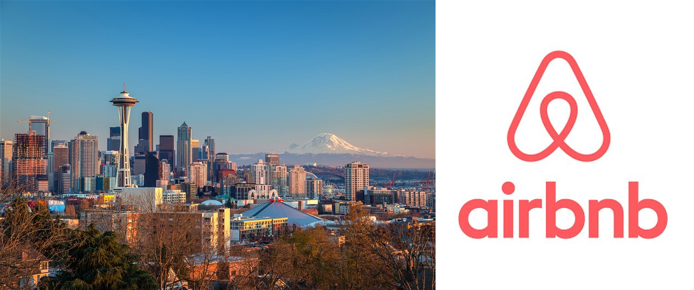
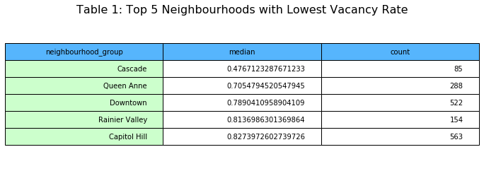
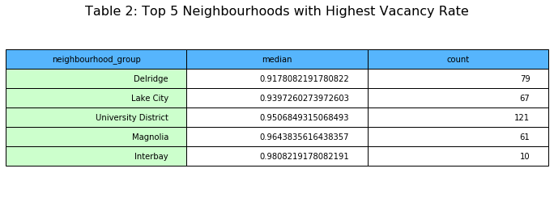
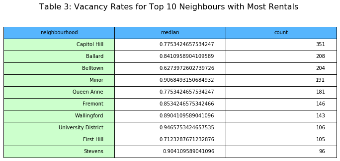

# Unveil the Vacancy Rate of Seattle Airbnb

If you live in Sleepless Seattle and have some spare money or a spare property, owning an Airbnb rental may sound like an attractive business idea. The most important homework you need to do before you dive in the Seattle Airbnb business is to understand the Seattle Airbnb market. One key factor that determines how profitable your Airbnb rental property is will be the vacancy rate. This also happens to be one of the factors that are often inconsistent with Airbnb owner's expectation.

Luckily, Airbnb is sharing the rental data with the world. With the help of **Python Pandas** and visualization tools like **matplotlib** and **seaborn**, we can unveil the real look of Seattle Airbnb's vacancy rate.

## 1. Data and Questions
Airbnb published a dataset for Seattle Airbnb rentals listed from 2016-01-04 to 2017-01-02(https://www.kaggle.com/airbnb/seattle/data). We will find answers for the following questions surrounding vacancy rate by analyzing this dataset.
1. Location, location, location. It's the number one rule for any real estate business. We would like to know which neighborhoods have the best performance in terms of vacancy rate.
2. Property type plays a big part when people deciding where to stay on vacation. Let's find out what type of property is Seattle Airbnb customers' favorite.
3. Have you ever wanted to book an Airbnb rental but given up because the owner's cancellation policy is too strict? Let's find out whether cancellation policy actually affects vacancy rate.
4. One dealbreaker for people looking for one or two nights stay is the owner's minimum nights policy. From the perspective of the Airbnb owners, how would you set minimum nights policy to minimize the vacancy rate of your rental property?

## 2. Vacancy Rate by Neighborhoods
First let's look at the vacancy rates for the neighborhoods. The median vacancy rate of all Seattle Airbnb properties used in our analysis is 84.4%, which means the property is not rented 84.4% time of a year. It is much higher than most owners' expectation. In the followings, Table 1 shows the top 5 most rented neighborhoods and Table 2 shows the top 5 worst rented neighborhoods, according to the median vacancy rate of the neighborhoods.

Table 3 below shows the top 10 neighborhoods with the most rental listings and their median vacancy rates. From these tables we can see that the neighborhood of Cascade is the most promising one. With only 47.7% vacancy rate, the properties in this neighborhood perform much better than the median. There are only 85 listings in this neighborhood, much lower than most other neighborhoods, which means the market in this neighborhood is far from saturated and less competitive.

## 3. Vacancy Rate by Property type
The type of an Airbnb rental can be viewed from two different perspectives: the structure type of the property (called property_type by the Airbnb dataset, such as house, condo or townhouse etc.) and how the owner would rent the property (called room_type by the Airbnb dataset, such as entire home, private room or shared room). The following heat map shows the vacancy rate for each property type and how they would be rented.

We can see that condos and townhouses are the obvious winners in Seattle. They have much lower vacancy rates
than other property types. It is also clear that no matter what property type the rental is, it is a lot easier to rent it out if people can rent the entire property.

## 4. Vacancy Rate by Cancellation policy
Now it's time to set property owner's policies. First, what cancellation policy should you set in order to lower your vacancy rate? Well, it may not matter as much as we thought. The plots below tell us that cancellation policy by itself is not a determining factor for vacancy rate. The vacancy rates are similar for properties with different cancellation policies, although there's a slightly larger number of property owners favoring the strict cancellation policy.

## 5. Vacancy Rate by Minimum Nights policy
When it comes to setting the minimum nights of stay for your rental property, it seems to be a dilemma. Setting it too high may scare away the customers who is seeking for flexibility; setting it too low may not give you the continuation of property occupancy. The following plot tells us longer minimum nights of stay can actually help lower the vacancy rate and 6 minimum nights of stay seems to be the test bet.  

## 6. Conclusions
A deep look at the Seattle Airbnb dataset has given us some answers to our questions regarding vacancy rate. If you want to buy a property in Seattle for your Airbnb business, the Cascade area is your best bet. You may want to consider condo or townhouse first, since they have much lower vacancy rate. Renting out the entire property also help lower vacancy rate. As to Cancellation Policy, just choose whatever makes you comfortable. At last, when setting the minimum nights of stay, try making it longer if it's shorter than 6 nights.  
